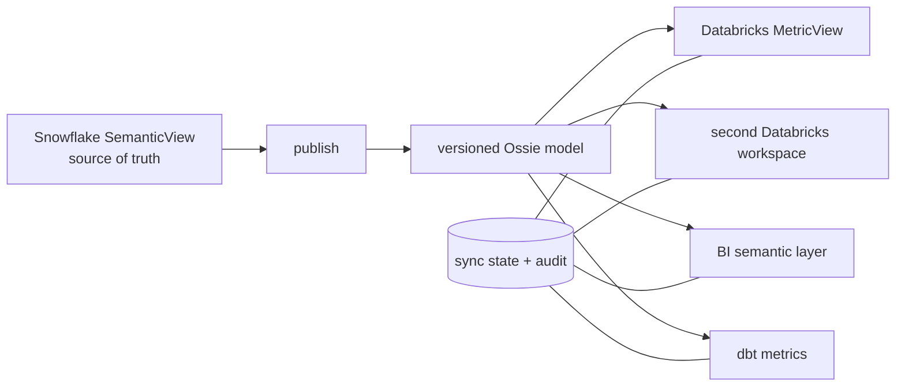

# Production Architecture

How the demo in this repo would be built if it had to run unattended, own real metric
definitions, and be handed to someone else to operate.

The demo optimizes for visibility: logic inline in notebooks, state in JSON files on S3,
polling every minute, conflicts resolved by a hardcoded rule. Every one of those choices is
wrong for production and right for a 15-minute walkthrough. This document says what each
would become, and why.

Nothing here is built. It is the starting point for the next build rather than a
description of what exists.

---

## What survives unchanged

Two things are load-bearing and would carry over as they are.

**The fingerprint.** Comparing a canonical projection of the model rather than a file
timestamp is what makes bidirectional sync terminate. `tests/test_no_loop.py` shows the
timestamp alternative writing forever. This is the core of the design and it does not change
with scale.

**The three-way decision.** `decide(local, remote, base, allowed=...)` is a well-understood
shape: it is the same comparison a version control merge makes against a common ancestor.
The `allowed` parameter is what lets one implementation serve both a peer-to-peer topology
and a publish-subscribe one.

Everything else below is transport, packaging, and operations.

---

## Code delivery: from inlined cells to a versioned package

The demo stamps `assets/ossie_sync/*.py` into notebook cells with
`assets/build_notebooks.py`, so the logic is readable on screen. In production the same
module becomes a versioned artifact, and the notebooks stop carrying code at all.

    ossie-sync/
      pyproject.toml            name = "ossie-sync", semantic versioning
      src/ossie_sync/
        fingerprint.py
        decide.py
        state.py
        shim.py
      tests/

Databricks installs the wheel as a cluster library or in a serverless environment spec, and
pins the version. Snowflake gets the same wheel on a stage and imports it:

```sql
CREATE OR REPLACE PROCEDURE SYNC_OSSIE(...)
  LANGUAGE PYTHON
  RUNTIME_VERSION = '3.11'
  PACKAGES = ('snowflake-snowpark-python', 'pyyaml')
  IMPORTS = ('@OSSIE_ARTIFACTS/ossie_sync-1.4.0-py3-none-any.whl')
  HANDLER = 'ossie_sync.entrypoints.snowflake_main';
```

The build then enforces one rule: **both platforms must run the same major.minor version.**
A fingerprint computed by 1.4 and one computed by 1.5 are not comparable, and mixing them
produces exactly the write-on-every-tick behaviour the design exists to prevent. Put the
version in the state file, and refuse to act when it does not match:

```json
{"fingerprint_version": "1", "module_version": "1.4.0", "base_fingerprint": "sha256:..."}
```

`assets/build_notebooks.py --check` has no equivalent in production. It is replaced by
ordinary dependency pinning.

---

## Triggering: from polling to change notification

A 1-minute poll is a demo affordance. It burns a warehouse and a cluster continuously to
discover that nothing changed, which `tests/test_no_loop.py` shows is the normal case.

**Snowflake side.** Replace the scheduled task with a task triggered on a stream over the
shared file's directory table, so it fires when the Ossie file actually lands:

```sql
CREATE STREAM ossie_model_stream ON STAGE OSSIE_S3_STAGE;

CREATE TASK sync_ossie
  WAREHOUSE = ...
  WHEN SYSTEM$STREAM_HAS_DATA('ossie_model_stream')
AS CALL SYNC_OSSIE(...);
```

Detecting a change to the *Semantic View* is harder, because there is no stream over DDL. The
options, in order of preference: subscribe to `ACCOUNT_USAGE.ACCESS_HISTORY` or an event
table for DDL on the view, have the deployment pipeline that changes semantic views call
the export directly, or keep a low-frequency reconciliation task (hourly, not minutely) as
a backstop. The third is the honest fallback and worth keeping regardless, because it also
catches changes made outside the pipeline.

**Databricks side.** A file-arrival trigger on the S3 prefix replaces the schedule. Keep
`max_concurrent_runs = 1`.

**Keep a reconciliation sweep.** Event-driven sync misses events. A scheduled full compare,
running hourly or nightly, catches drift that notifications dropped. It should alert when it
finds work to do, because finding work means a notification was lost.

---

## State: from JSON on S3 to a transactional store

The demo writes one JSON file per platform, which works because each file has exactly one
writer. It fails as soon as there is more than one consumer per platform, or a second
Databricks workspace, or a partial write.

Move state into a table. Snowflake is the natural home if it is already in the topology:

```sql
CREATE TABLE ossie_sync_state (
  model_name        STRING,
  platform          STRING,
  base_fingerprint  STRING,
  module_version    STRING,
  last_action       STRING,
  updated_at        TIMESTAMP_LTZ,
  PRIMARY KEY (model_name, platform)
);
```

This buys three things the JSON files cannot: atomic read-modify-write, history when you add
an append-only audit table alongside it, and a single place to answer "what does every
consumer currently believe". DynamoDB is the equivalent if the sync must not depend on
Snowflake being available.

**Add a lease.** The demo relies on offset schedules to avoid two agents writing the shared
file at once, which is a probabilistic argument rather than a guarantee. Production needs a
short-lived lease per model:

```
acquire(model_name, holder, ttl=60s) -> bool
```

An agent that cannot acquire the lease skips the tick and tries again. This matters most
during the window between reading the shared file and writing it back, which is where a
concurrent write is silently lost.

---

## Conflict handling: from Snowflake-wins to governance

This is the weakest part of the demo and the part most likely to be challenged in a
customer conversation. `CONFLICT_WINNER = "snowflake"` discards the other side's edit with
nothing more than a log line. The person who made the change is not told.

A production design needs three things the demo lacks:

**Never discard silently.** On conflict, write both versions to a quarantine location, do
not touch either platform, and notify. The sync stops for that model until a human resolves
it. Halting is safer than guessing, because a wrong automatic merge to a metric definition
produces wrong numbers in reports, which is worse than a stalled sync.

**Field-level merge where it is safe.** Two sides adding *different* metrics is not really a
conflict; it is a merge that succeeds. Two sides changing the *same* metric's expression is a
real conflict. The projection the fingerprint already builds is the right structure to diff
at this granularity: compare metric by metric rather than model by model, and only escalate
genuine overlaps.

**Ownership as configuration.** Rather than one global winner, express ownership per model
or per metric: `sales.total_order_amount` is owned by the finance team in Snowflake, while
`sales.experiment_*` is owned by the data science team in Databricks. Then most conflicts
resolve by policy instead of by escalation, and the policy is reviewable.

---

## Topology: one consumer to many

The unidirectional architecture claims fan-out but the demo only shows Databricks. Adding
consumers changes two things.

The shared model gets a stable location and a version history, so a consumer can pin to a
known-good definition rather than always taking the head. Object versioning on the S3 prefix
is the cheapest way to get this.

Each consumer gets its own state row and syncs independently. One broken consumer must not
block the others, and each needs its own health signal. A consumer that has not converged
within an expected window is the thing to alert on, not an individual failed run.



---

## Observability

The demo's observability is the verdict string in a task's `return_value` and a Databricks
run output. That is enough to watch a demo and not enough to operate anything.

What to emit, per run, per model, per platform: the action taken, the three fingerprints,
the module version, and the duration. Snowflake writes to an event table; Databricks emits
to the same destination or to whatever the platform team already uses.

What to alert on:

| Signal | Why it matters |
|---|---|
| `CONFLICT` on any model | needs a human, and the sync for that model has stopped |
| `REVERT_LOCAL_DRIFT` | someone is authoring in the wrong place, which is a process problem |
| no `NO_CHANGE` for a model within an expected window | the sync is stuck or the loop is live |
| repeated write actions with no intervening change | the fingerprint is not converging |
| module version mismatch between platforms | fingerprints are not comparable |

The fourth row is the one to build first. It is the automated form of the check
`tests/test_no_loop.py` performs offline, and it is the failure that a demo can hide.

---

## Failure modes worth designing for

**Partial write of the shared file.** A consumer reading mid-write gets truncated YAML. Write
to a temporary key and copy into place, or use object versioning and read a specific version.
The demo's `dbutils.fs.put` is not atomic.

**Converter version skew.** Databricks depends on the Apache Ossie converter, pinned here to
a commit. A converter upgrade can change the round trip and therefore the fingerprint of an
unchanged model, which shows up as every model appearing to change at once. Run
`tests/test_convergence.py` against the new converter in CI before upgrading, and expect to
re-baseline every state row when the fingerprint definition itself changes.

**Fingerprint definition change.** Widening what the fingerprint covers, for example to
include descriptions, invalidates every stored base. Version the fingerprint, and on a
version bump adopt rather than sync: recompute, store, take no action. Otherwise the first
run after an upgrade rewrites every model on both platforms.

**Semantic View replaced by an unrelated pipeline.** A deployment that recreates the view
from source control looks identical to a user edit. This is a reason to drive the export from
the deployment pipeline rather than inferring it after the fact.

**Snowflake and Databricks disagree about what is expressible.** Facts, comments, and
descriptions are excluded from the fingerprint precisely because Databricks cannot
round-trip them. When either platform gains expressiveness, that exclusion list should
shrink, deliberately and with a fingerprint version bump.

---

## Security and access

The demo runs the Snowflake procedure `EXECUTE AS CALLER` under `ACCOUNTADMIN`, which is
appropriate for a sandbox and nothing else.

Production wants a dedicated service role holding only what the sync needs: read on the
source tables' metadata, create and replace on the specific semantic views it owns, read and
write on the Ossie stage prefix, and nothing more. The equivalent on the Databricks side is a
service principal with `CREATE VIEW` scoped to the mirror schema.

Grant the sync role the ability to modify only the models it manages. A sync process with
account-wide DDL rights is a sync process that can replace any semantic view in the account
because of a bug in a fingerprint comparison.

---

## What to build first

In order, because each step makes the next safe:

1. Package `ossie_sync` as a wheel, with the version recorded in state and checked at
   runtime. Without this, nothing else is trustworthy.
2. Move state into a table with a lease. This closes the concurrent-write hole.
3. Add the observability signals, particularly non-convergence detection.
4. Replace polling with change notification, keeping a low-frequency reconciliation sweep.
5. Replace Snowflake-wins with quarantine and notify, then add per-metric ownership.
6. Add the second consumer, which is what turns fan-out from a claim into a demonstrated
   property.

Steps 1 through 3 are the ones that make the difference between a demo and something that
can own a metric definition.
