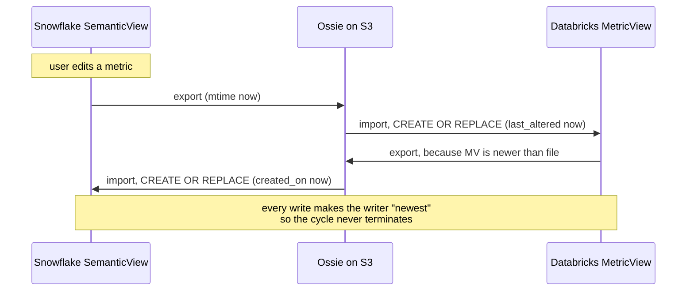
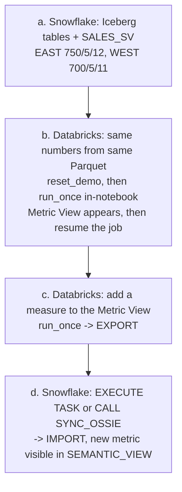
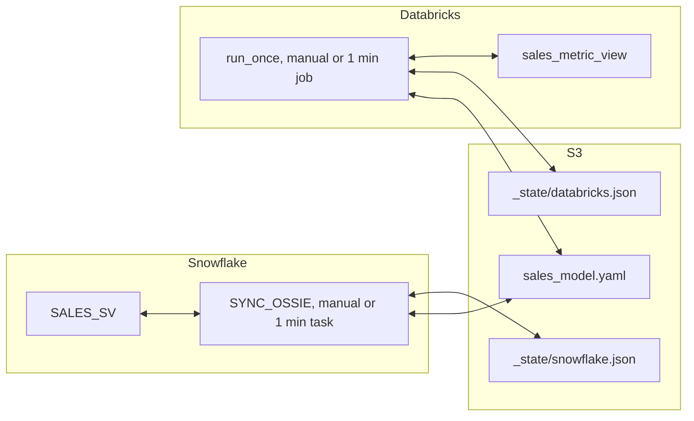

# Bidirectional Ossie Sync

## Context

Repo: `/Users/began/Dev/cortex_cli/projects/interoperable_semantics`. All paths below are relative to it. The plan file itself moves to `docs/plans/bidirectional-ossie-sync.plan.md` in this repo as step 0.

What exists today:

- [assets/notebooks/01_demo_and_export.ipynb](assets/notebooks/01_demo_and_export.ipynb) has `EXPORT_OSSIE_TO_STAGE` and the `MONITOR_SV_CHANGES` task, comparing `SHOW SEMANTIC VIEWS."last_altered"` against `DIRECTORY()."LAST_MODIFIED"`.
- [assets/notebooks/03_snowflake_import_from_ossie.ipynb](assets/notebooks/03_snowflake_import_from_ossie.ipynb) has `IMPORT_OSSIE_FROM_STAGE` and `MONITOR_OSSIE_IMPORT`, comparing `"created_on"` against file mtime. Its markdown already names the defect this plan fixes: "if left on will result in a loop every time you update a Semantic View."
- [assets/notebooks/02b_databricks_ossie_sync.ipynb](assets/notebooks/02b_databricks_ossie_sync.ipynb) is the tested one-way importer. Verified live: `information_schema.tables.last_altered` is populated for `table_type = 'METRIC_VIEW'`, so the `DESCRIBE` fallback never fires.

Two facts that shape the design:

1. **Snowflake needs no converter.** It reads and writes Ossie natively via `SYSTEM$READ_OSSIE_YAML_FROM_SEMANTIC_VIEW` and `SYSTEM$CREATE_SEMANTIC_VIEW_FROM_OSSIE_YAML`. Only Databricks needs the Apache converter and the shim, so the code shared across both platforms is just the fingerprint and the decision function. The generated block stays small enough to read inline.
2. **The round trip is not byte-stable.** The shim in notebook 02 changes dataset name case, swaps `primary_key` for `unique_keys`, drops facts, rewrites dialect labels, and adds or removes table qualifiers (`SUM(orders.order_amount)` against `SUM(order_amount)`). Hashing raw YAML will never converge.

## The loop, and why timestamps cannot fix it



Any write bumps the writer's timestamp, making it look like a fresh change to the other side. The fix is to compare what the model says, not when it was written.

## Core design: fingerprint convergence with a per-side base

Each side computes a `semantic_fingerprint` over a platform-neutral projection of an Ossie document and remembers the fingerprint it last agreed on (its `base`). Three-way comparison, terminating in one hop:

```python
def decide(local_fp, remote_fp, base_fp, allowed=("IMPORT", "EXPORT")):
    if local_fp == remote_fp:              return "NO_CHANGE"
    if base_fp is None:                    return "ADOPT"
    if local_fp == base_fp:                action = "IMPORT"
    elif remote_fp == base_fp:             action = "EXPORT"
    else:                                  action = "CONFLICT"
    if action == "EXPORT" and "EXPORT" not in allowed:
        return "REVERT_LOCAL_DRIFT"        # Snowflake-managed mode
    return action
```

After `IMPORT`, `base := remote_fp`. After `EXPORT`, `base := local_fp`. The next tick sees `local_fp == remote_fp` and returns `NO_CHANGE`. That is the loop termination.

The `allowed` parameter is what makes the unidirectional variant reuse this function unchanged rather than forking it.

**The fingerprint is the whole design.** It hashes only what both platforms can express, qualifiers stripped so the dialects agree:

```
tables:        [{alias: "orders", source: "orders"}, ...]        # last path component, lowercased
relationships: [{from: "orders", to: "customers", keys: ["customer_id"]}]
dimensions:    ["customers.customer_name", "customers.region"]   # sorted
metrics:       [{name: "order_count", expr: "count(order_id)"}]  # sorted, qualifiers stripped
```

Deliberately excluded: Ossie `version`, dialect labels, comments and descriptions, field order, dataset name casing, and Snowflake-only `FACTS`. Consequence for the README: **a change only to a comment, or only to a fact, does not propagate.** Including any of these breaks convergence because Databricks cannot round-trip them.

## State on S3, one writer per file

```
s3://<bucket>/ossie/
  sales_model.yaml          <- shared model, either side may write
  _state/snowflake.json     <- written only by Snowflake
  _state/databricks.json    <- written only by Databricks
```

`{"base_fingerprint": "sha256:...", "last_action": "IMPORT", "at": "...", "by": "snowflake"}`

One writer per state file means no lock and no race. Both sides write `sales_model.yaml` in Snowflake-dialect Ossie, so Snowflake imports it natively and Databricks applies `snowflake_to_converter` on read. Schedules are offset: Snowflake on the minute, Databricks at 30 seconds.

Drop the `SALES_SV_V2` string replacement from the Databricks export path; with one shared file the model name is preserved, not rewritten.

## One function, two triggers

The 1-minute latency must not gate the live demo, so every sync is a single function with two entry points:

| | Manual, on demand | Background, 1 minute |
|---|---|---|
| Snowflake | `CALL SYNC_OSSIE(...)`, or `EXECUTE TASK SYNC_OSSIE_TASK` which works while the task is suspended | `ALTER TASK ... RESUME` |
| Databricks | `run_once()` in a notebook cell, printing the decision and the resulting measures | Jobs schedule, `max_concurrent_runs = 1` |

The scheduled trigger calls exactly the same procedure or function as the manual cell, so what the audience watches in the notebook is what runs in the background. Notebook 21 also gets a `reset_demo()` helper that drops the Metric View and clears `_state/databricks.json`, so step (b) can show it being created from nothing.

## Demo flow



Steps (c) and (d) are driven manually so nothing waits on a tick; the background schedules stay resumed the whole time to carry any further ad-hoc edits. Because both triggers share one code path, a manual run and a scheduled run cannot disagree.

## Architecture A: fully bidirectional



`allowed = ("IMPORT", "EXPORT")` on both sides. `CONFLICT` resolves as Snowflake wins: Databricks reverts to the shared file and logs it. This is a demoware simplification that silently discards the Databricks edit, and it is labelled as such in the README and in the notebook markdown.

## Architecture B: Snowflake managed, next iteration

Separate notebooks, `10_snowflake_managed_export.ipynb` and `11_databricks_managed_mirror.ipynb`, which import the same `ossie_sync` module and never overwrite the bidirectional pair. The only behavioural difference is the argument: Snowflake runs with `allowed = ("EXPORT",)`, Databricks with `allowed = ("IMPORT",)`. A Metric View edited locally then yields `REVERT_LOCAL_DRIFT` and is overwritten on the next tick. Demo note: adding a measure on the Databricks side gets reverted under this architecture, so that step moves to Snowflake.

## Implementation steps

0. **Move the plan file** from `demos/multi_account_lookups/.snowflake/cortex/plans/` to `docs/plans/bidirectional-ossie-sync.plan.md` in this repo, and work from the repo root from here on.
1. **`assets/ossie_sync/` plus offline convergence test.** `fingerprint.py`, `decide.py`, `state.py`. Then `tests/test_convergence.py`, which uses the vendored [assets/ossie_converter](assets/ossie_converter) in-process to run SF Ossie -> shim -> MV YAML -> Ossie -> SF Ossie twice, printing the fingerprint at each hop and asserting stability. Expect to iterate on the canonicalizer; this is where the real difficulty lives and it needs no cloud access.
2. **`assets/build_notebooks.py`.** Stamps module source between `# --- BEGIN GENERATED: ossie_sync.fingerprint ---` markers in the target notebooks, with a `--check` mode. Extend `.git/hooks/pre-commit` to fail when a notebook is stale.
3. **Notebook `20_snowflake_bidirectional_sync.ipynb`.** Python stored procedure `SYNC_OSSIE` with `PACKAGES = ('snowflake-snowpark-python','pyyaml')` and the generated block inline in the SQL cell, so the logic is visible rather than hidden in a stage zip. It reads `SYSTEM$READ_OSSIE_YAML_FROM_SEMANTIC_VIEW` for `local_fp`, `sales_model.yaml` for `remote_fp`, its own state file for `base_fp`, then acts. Returns a readable one-line verdict. Plus a manual `CALL` cell, a suspended 1-minute task, `EXECUTE TASK` and `RESUME`/`SUSPEND` cells, and a `TASK_HISTORY` cell to show background runs. Keep `ALTER STAGE ... REFRESH` before every `DIRECTORY()` read.
4. **Notebook `21_databricks_bidirectional_sync.ipynb`.** Extends 02b with an export path: `local_fp` from `SHOW CREATE TABLE` -> `convert_metric_view_to_ossie` -> fingerprint; the same decision; export via `converter_to_snowflake` to the shared file. Adds `reset_demo()`, a `run_once()` cell that prints the decision and resulting measures, and a `display()` of the Metric View so step (b) lands on screen. `dbutils.notebook.exit` reports the action for the Jobs run history.
5. **Demo runbook.** `docs/DEMO_RUNBOOK.md`: the four steps with the exact cells to run, the manual-trigger commands for both platforms, expected verdict at each step, and a reset procedure to rerun the demo from scratch.
6. **Live-test the bidirectional pair** from the CLI, driving both manual and scheduled triggers.
7. **Snowflake-managed notebooks (10, 11)** built on the same module with restricted `allowed`, as a separate deliverable that leaves 20 and 21 untouched.
8. **`docs/PRODUCTION_ARCHITECTURE.md`** for the Option A rollout: `ossie_sync` as a versioned wheel installed as a Databricks cluster library and packaged to stage for the Snowflake sproc; state in a Snowflake table or DynamoDB rather than S3 JSON; a real lease or lock; conflict governance with approval instead of Snowflake-wins; observability via the event table and Jobs API; failure modes including partial write, converter version skew, and fingerprint-definition change with its migration path; fan-out to more than one downstream consumer.
9. **README plus `clean-ai-slop`** across every markdown cell and both docs, matching the prose style of notebooks 01 and 03.

## Verification

- `python tests/test_convergence.py` — fingerprint identical at every hop of two full round trips. Gate on this before touching either platform.
- `python assets/build_notebooks.py --check` — notebooks match the module.
- Rehearse the demo end to end with schedules resumed, driving (c) and (d) manually: exactly one `EXPORT` then one `IMPORT`, then `NO_CHANGE` on both sides for three consecutive ticks. Oscillation past that means the fingerprint is not canonical.
- Manual and scheduled parity: `EXECUTE TASK` and `CALL SYNC_OSSIE` produce the same verdict for the same state.
- Snowflake edit path: add a metric to `SALES_SV`, confirm it reaches the Metric View and is queryable with `MEASURE()`.
- Conflict: edit both within one window, expect `CONFLICT` on both sides and the Snowflake definition to win.
- `reset_demo()` returns the environment to a clean pre-demo state and the whole flow can be run twice in a row.
- Numbers hold throughout: EAST 750/5/12, WEST 700/5/11 on both platforms.
- Confirm `SYSTEM$CREATE_SEMANTIC_VIEW_FROM_OSSIE_YAML` replaces an existing view of the same name rather than erroring, since the import path depends on it.

## Critical Files

- [assets/ossie_sync/fingerprint.py](assets/ossie_sync/fingerprint.py) - new; the canonical projection that makes convergence possible
- [assets/ossie_sync/decide.py](assets/ossie_sync/decide.py) - new; the `allowed` parameter is what lets both architectures share one implementation
- [assets/notebooks/02b_databricks_ossie_sync.ipynb](assets/notebooks/02b_databricks_ossie_sync.ipynb) - tested base for notebooks 21 and 11
- [assets/notebooks/03_snowflake_import_from_ossie.ipynb](assets/notebooks/03_snowflake_import_from_ossie.ipynb) - `IMPORT_OSSIE_FROM_STAGE` and the looping task being replaced
- [assets/ossie_converter/metric_view_to_ossie.py](assets/ossie_converter/metric_view_to_ossie.py) - defines what survives the Databricks round trip, and therefore what the fingerprint may include
